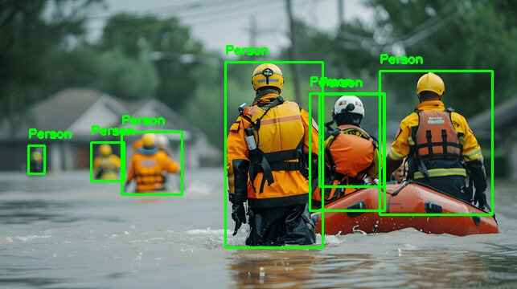

# AI-Based Disaster Survivor Detection System using YOLOv8

## Overview

## Overview

This project is a computer vision application developed using YOLOv8 and OpenCV to detect people in disaster-affected environments. The system processes input images, identifies individuals using object detection, draws bounding boxes around detected persons, and generates an output image for rescue analysis.

The project demonstrates the application of deep learning techniques in disaster response scenarios where rapid identification of survivors can assist rescue teams.

## Features

* Person detection using YOLOv8
* Bounding box visualization
* Detection count
* Processed image output

## Technologies Used

* Python
* YOLOv8 (Ultralytics)
* OpenCV

## Project Structure

Disaster-Rescue-Detection-YOLOv8/

├── dataset/

├── outputs/

├── detect.py

├── requirements.txt

├── README.md

└── .gitignore

## How to Run

1. Activate the virtual environment
2. Install dependencies from requirements.txt
3. Run:

python detect.py

## Output

The processed image is saved in the outputs folder as result.jpg.

## Sample Output

The image below shows the detection result generated by the system.

