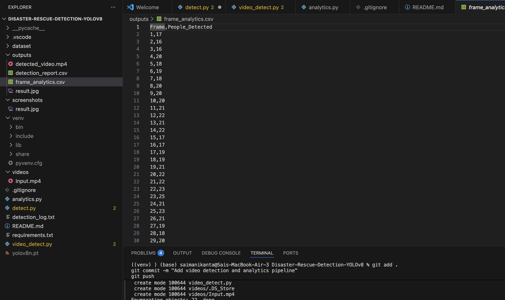
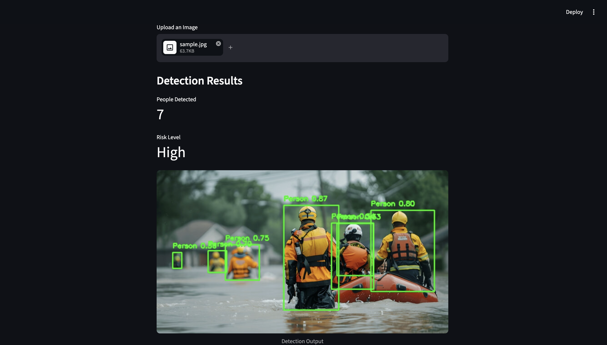

# AI-Based Disaster Survivor Detection System using YOLOv8

## Overview

The Disaster Rescue Detection System is a computer vision application designed to assist rescue operations in disaster-affected areas. The system uses YOLOv8 to detect stranded individuals from images and videos, generate alerts, assess risk levels, and provide analytical reports for rescue teams.

The project also includes an interactive Streamlit dashboard that allows users to upload images, perform survivor detection, and download annotated results directly through a web interface.

---

## Features

* YOLOv8-based person detection
* Survivor counting and confidence scoring
* Automated risk-level assessment
* Alert generation for detected survivors
* Image-based detection and annotation
* Video-based detection and processing
* Frame-wise analytics generation
* CSV report creation
* Interactive Streamlit dashboard
* Downloadable detection results

---

## Technology Stack

* Python
* YOLOv8
* OpenCV
* Streamlit
* Pandas
* Git & GitHub

---

## Project Structure

```text
Disaster-Rescue-Detection-YOLOv8
│
├── dataset/
│   └── sample.jpg
│
├── outputs/
│   ├── result.jpg
│   ├── detected_video.mp4
│   ├── frame_analytics.csv
│   └── streamlit_result.jpg
│
├── screenshots/
│   ├── result.jpg
│   └── analytics.png
│
├── detect.py
├── video_detect.py
├── analytics.py
├── app.py
├── requirements.txt
└── README.md
```

---

## Streamlit Dashboard

The project includes an interactive Streamlit dashboard that enables:

* Image upload and processing
* Survivor detection
* Person counting
* Risk-level assessment
* Annotated image visualization
* Downloadable detection results

Run the dashboard using:

```bash
python -m streamlit run app.py
```

---

## Detection Workflow

```text
Input Image / Video
        ↓
      YOLOv8
        ↓
  Person Detection
        ↓
 Survivor Counting
        ↓
 Risk Assessment
        ↓
 Analytics Generation
        ↓
 Annotated Output
```

---

## Results

* Frames Processed: 313
* Total Person Detections: 4222
* Confidence-Based Detection
* Survivor Alert Generation
* Risk-Level Assessment
* Frame-wise Analytics CSV
* Annotated Video Output
* Interactive Streamlit Dashboard

---

## Sample Outputs

### Detection Result


### Analytics Report



## Streamlit Dashboard

## Streamlit Dashboard



### Detection Result


---

## Future Enhancements

* Real-time webcam detection
* Live disaster monitoring
* GPS integration
* Rescue team notification system
* Cloud deployment
* Multi-object rescue analytics


